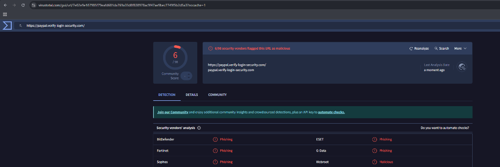
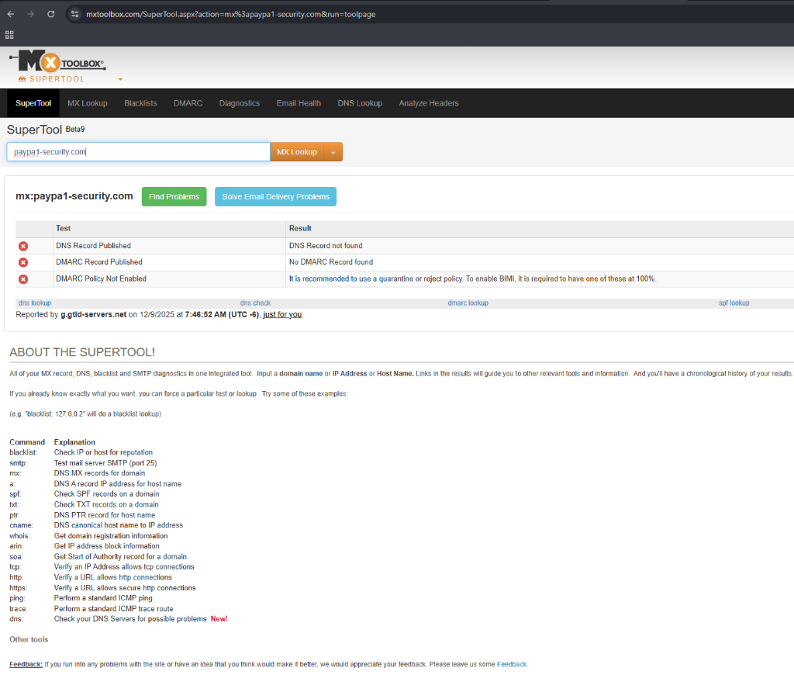

# 🔒 Phishing Email Analysis Report

---

## 📋 Executive Summary

| Field | Details |
|-------|---------|
| 📅 **Date** | 2025-12-09 |
| 👤 **Analyst** | Cyber Security Intern |
| 📧 **Subject** | Urgent: Your PayPal account is locked! |
| 📤 **Sender** | `support@paypa1-security.com` |
| ⚠️ **Verdict** | **PHISHING - CONFIRMED** |

---

## 🎯 1. Overview

This report presents a detailed analysis of a suspicious email impersonating PayPal. The email uses **social engineering tactics** to trick the recipient into clicking a malicious link under the guise of account security.

> **Key Finding:** The email is a phishing attempt designed to steal user credentials.

---

## 📨 2. Email Header Analysis

The email headers reveal critical authentication failures:

| Check | Result | Meaning |
|-------|--------|---------|
| 🔴 **SPF** | `FAIL` | Sender IP not authorized for this domain |
| 🔴 **DKIM** | `None` | No digital signature present |
| 🔴 **DMARC** | `FAIL` | Email failed authentication policy |

### 🖥️ Sender Details

| Field | Value | Analysis |
|-------|-------|----------|
| **From** | `support@paypa1-security.com` | ⚠️ Typosquatted domain (`paypa1` vs `paypal`) |
| **IP** | `192.0.2.45` | ❌ Not an official PayPal server |

> 💡 **What is Typosquatting?**  
> Attackers register domains that look similar to legitimate ones by using character substitutions (e.g., `1` instead of `l`).

---

## 🔗 3. Malicious Link Analysis

### URL Breakdown

```
https://paypal.verify-login-security.com
        └─────┘ └────────────────────────┘
        Subdomain      Root Domain
```

| Component | Value | Issue |
|-----------|-------|-------|
| **Subdomain** | `paypal` | Deceptive—makes URL look legitimate |
| **Root Domain** | `verify-login-security.com` | ❌ Not owned by PayPal |
| **Protocol** | `https` | ⚠️ SSL does NOT guarantee safety |

### 🛡️ VirusTotal Scan Results

| Vendor | Detection |
|--------|-----------|
| 🔴 BitDefender | Phishing |
| 🔴 Fortinet | Phishing |
| 🔴 Sophos | Phishing |
| 🔴 ESET | Phishing |
| 🔴 G Data | Phishing |
| 🔴 Webroot | Malicious |

> ⚠️ **6 out of 98 vendors flagged this URL as malicious.**

---

## 🧠 4. Social Engineering Indicators

The attacker employed multiple psychological manipulation techniques:

### 🚨 Urgency Tactics
> *"Failure to act in the next 24 hours will result in permanent suspension."*

Creates **panic** to bypass rational thinking.

### 🏛️ Authority Impersonation
> *"PayPal Security Team"*

Uses a trusted brand name to establish **false credibility**.

### 👤 Generic Greeting
> *"Dear Customer"*

Indicates a **mass phishing campaign**—legitimate services use your name.

### 🔐 Action Request
> *"Click the link below to verify your identity"*

Directs victim to a **credential harvesting page**.

---

## ⚡ 5. Risk Assessment

| Category | Rating | Details |
|----------|--------|---------|
| **Severity** | 🔴 HIGH | Credential theft risk |
| **Target** | 💳 Financial | PayPal account takeover |
| **Attack Type** | 🎣 Phishing | Credential harvesting |
| **Spread** | 📧 Mass Campaign | Generic greeting suggests bulk send |

### Potential Impact
- 🔑 **Credential Theft**: Username and password compromise
- 💰 **Financial Loss**: Unauthorized transactions
- 🆔 **Identity Theft**: Personal data exposure

---

## ✅ 6. Conclusion & Recommendations

### 📌 Verdict
This email is a **confirmed phishing attempt** based on:

1. ❌ Failed email authentication (SPF/DKIM/DMARC)
2. ❌ Typosquatted sender domain (`paypa1`)
3. ❌ Fraudulent URL structure
4. ❌ Multiple vendor detections

### 🛡️ Recommended Actions

| Action | Priority |
|--------|----------|
| 🚫 Do NOT click any links | Critical |
| 🗑️ Mark as spam/phishing | High |
| 🔒 Block sender domain | High |
| 📢 Report to PayPal | Medium |
| 🔐 Enable 2FA on accounts | Preventive |

---

## 📸 Evidence Screenshots

### Header Analysis Tool


### URL Reputation Check


---

> 📝 **Report prepared as part of Cyber Security Internship - Day 2 Task**
